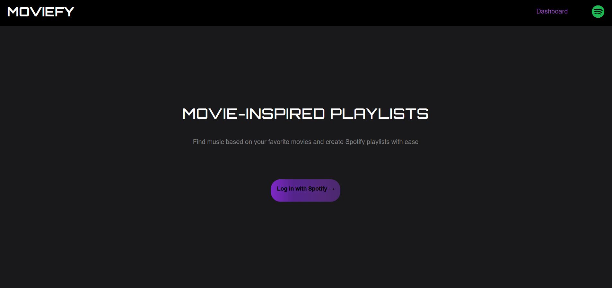

# MovieFy🎬🎶

MovieFy is a web application built to streamline the process of finding and creating Spotify playlists inspired by movies. Users can search by movie title and retrieve playlists that others have already associated with the film, removing the need to sift through multiple options or select tracks to match the movie’s atmosphere. This functionality enables users to quickly create or save playlists that reflect the movie’s theme.

## Visit The Site
Feel free to check out the [#!]()

## Core Features and Functionality
1. **Spotify Authentication and Authorization:** MovieFy uses Spotify's OAuth 2.0 for secure authentication, enabling users to log in with their Spotify account.
2. **Movie-Related Playlist Search:** Users can search for playlists based on a desired movie title. MovieFy sends API requests to Spotify to retrieve relevant music, populating the interface with the fetched tracks.
3. **Refresh Functionality:** Users can retrieve more track options using the refresh feature to fetch additional music selections.
4. **Playlist Creation:** Users can create a new Spotify playlist that will be added to their Spotify library.

## Project Structure
MovieFy's primary technologies and frameworks:

- **Python & Flask:** The backend is built with Flask to handle user authentication with Spotify, manage API requests, sessions, and routing, and serve dynamic content.
- **API Integration:** MovieFy interacts directly with the SPotify API to perform various operations on Spotify data.
- **JavaScript & Template Rendering:** The application's frontend utilizes Flask's templating engine, Jinja2, to dynamically render pages while using JavaScript to provide interactivity.

